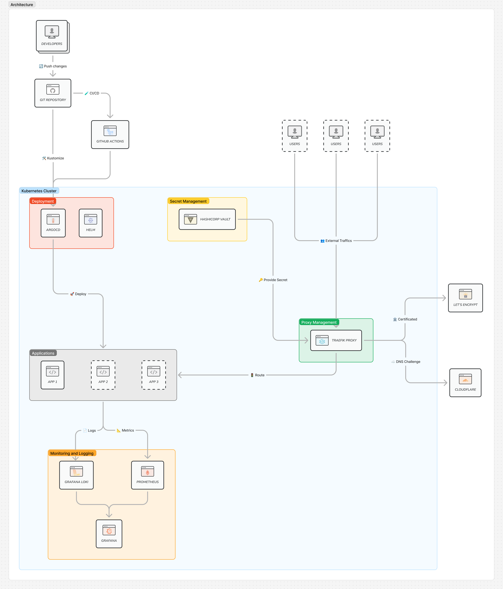

# 🦦 Kubernetes Automated Load Balancer

A project focused on designing and implementing automated load balancing within a Kubernetes cluster using GitOps practices. This project aims to enhance scalability, reliability, and performance by dynamically distributing traffic across multiple services, while maintaining infrastructure as code and automated deployment processes through continuous integration and delivery pipelines.

## 🛠 System Requirements

- 🥨 [K3s](https://k3s.io/) - Lightweight Kubernetes Distribution
- 🐋 [Docker](https://www.docker.com/) - Containerization
- ☸️ [Kubernetes](https://kubernetes.io/) - Container Orchestration
- 📦 [Helm](https://helm.sh/) - Package Manager for Kubernetes
- 🚀 [GitHub Actions](https://github.com/actions) - Continuous Integration and Delivery Pipelines
- 🐙 [ArgoCD](https://argoproj.github.io/argo-cd/) - GitOps Continuous Delivery
- 🚦 [Traefik](https://traefik.io/) - Ingress Controller for Kubernetes
- 📊 [Prometheus](https://prometheus.io/) - Monitoring and Alerting Toolkit
- 📈 [Grafana](https://grafana.com/) - Observability Platform
- 📉 [Loki](https://grafana.com/oss/loki/) - Log Aggregation System

## ✨ Features

- **Automated Load Balancing**: Automatically distribute incoming traffic across multiple services within a Kubernetes cluster.
- **GitOps Practices**: Maintain infrastructure as code and automated deployment processes through GitOps practices.
- **Auto-Scaling**: Dynamically scale services based on traffic load and resource utilization.
- **Limitless Scalability**: Scale services horizontally and vertically to meet growing demands.
- **Rolling Updates**: Perform zero-downtime deployments and updates with rolling updates.
- **Monitoring and Logging**: Monitor and log cluster performance, resource utilization, and service health.

## 🏗️ Architecture

## 🎯 Project Phases

Our project is divided into six main phases:

1. Preparation and Design
2. Infrastructure Setup
3. Load Balancer Implementation
4. Monitoring and Logging
5. Testing and Optimization
6. Documentation and Handover

For detailed information about each phase, including objectives, tasks, and deliverables, please refer to our [Project Wiki](https://github.com/PunGrumpy/kubernetes-automated-load-balancer/wiki).

## 📚 Documentation

Comprehensive documentation for this project, including architectural details, configuration guides, and troubleshooting tips, can be found in our [Project Wiki](https://github.com/PunGrumpy/kubernetes-automated-load-balancer/wiki).

## 📄 License

This project is licensed under the [MIT License](LICENSE). See the LICENSE file in the repository for full details.
